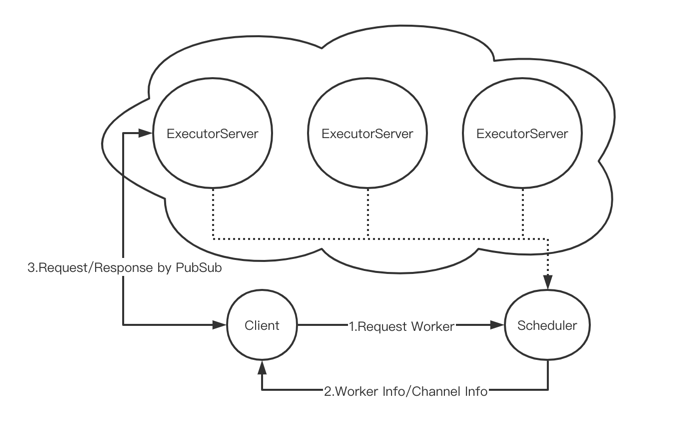

# kencloud-orchestrator-demo

# Scheduler
用于就近调度计算节点，并告知客户端该节点的PubSub通道，用于发送任务消息和接收结果

# Executor
计算节点，从PubSub中接收任务消息，在docker:lambda中计算并将结果输出在PubSub中

# Client
客户端。向Scheduler请求调度最近计算节点，然后和计算节点通过PubSub提交任务并得到结果

#
